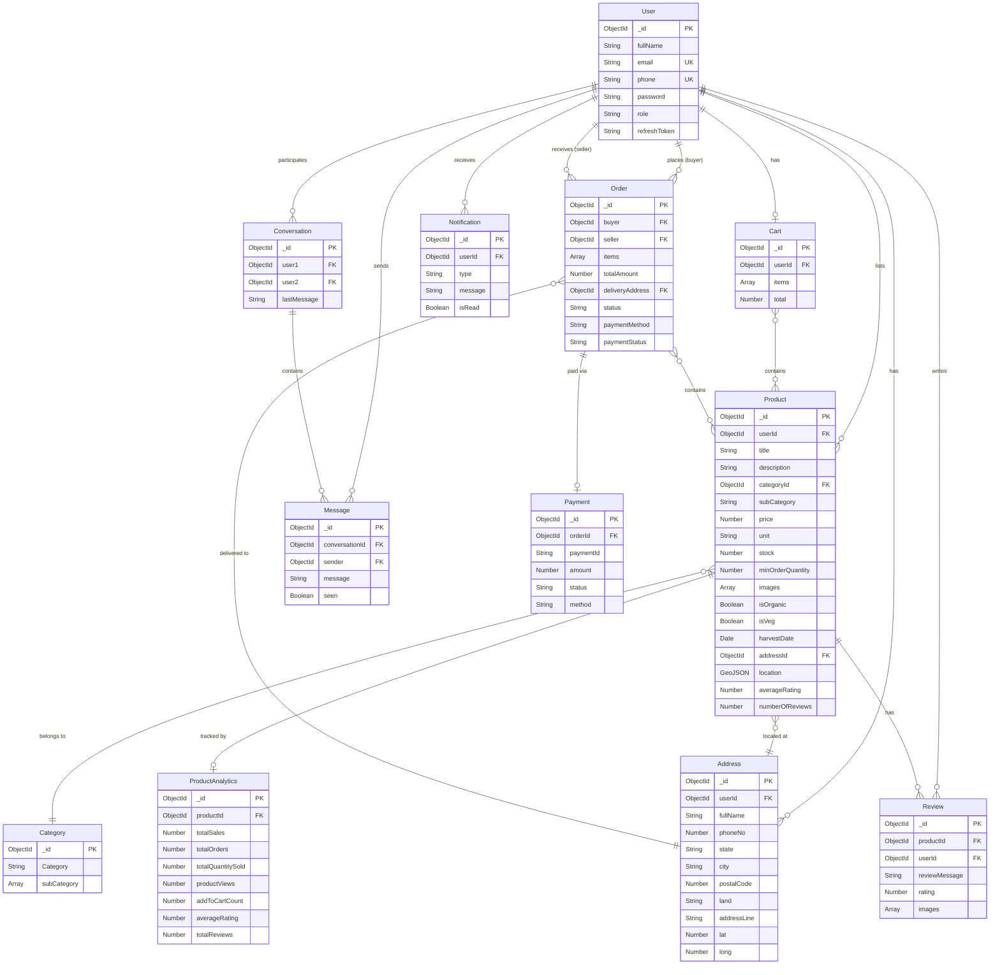
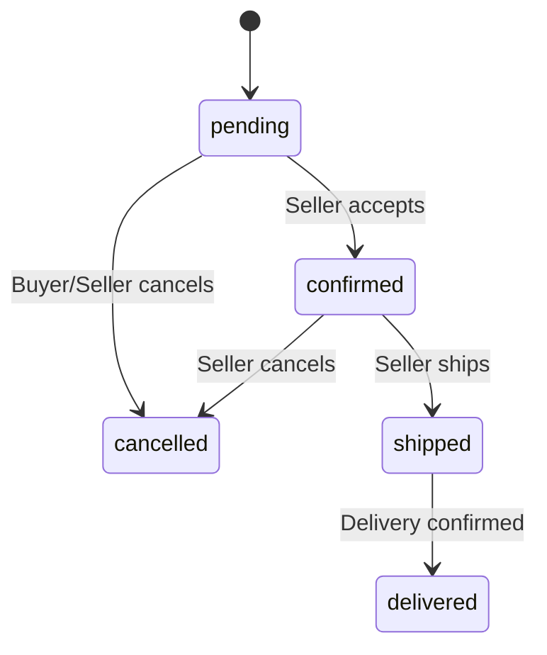

# 🌾 FarmMarket — Database Documentation

> **Database**: MongoDB (via Mongoose ODM)
> **Total Collections**: 12
> **Last Updated**: 2026-02-22

---

## Entity Relationship Diagram

---

## Collection Details

### 1. User

> Core authentication & identity model. Supports signup/login via email, phone, or both.

**File**: [`User.model.js`](file:///c:/Users/RM459/OneDrive/Desktop/Full-Stack/server/models/User.model.js)

| Field | Type | Required | Constraints | Description |
|-------|------|----------|-------------|-------------|
| `fullName` | String | ✅ | trim | User's display name |
| `email` | String | ❌ | unique, sparse, lowercase, regex validated | Login identifier (optional if phone provided) |
| `phone` | String | ❌ | unique, sparse, trim | Login identifier (optional if email provided) |
| `password` | String | ✅ | minlength: 6, auto-hashed (bcrypt, 12 rounds) | Hashed password |
| `role` | String | ❌ | enum: `user`, `farmer` · default: `user` | User role |
| `refreshToken` | String | ❌ | select: false | JWT refresh token (hidden from queries by default) |

**Pre-save hooks**:
- `validate`: Ensures at least one of `email` or `phone` is provided
- `save`: Auto-hashes password using bcrypt (12 salt rounds)

**Instance methods**: `isPassCorrect()`, `generateAccessToken()`, `generateRefreshToken()`

| Index | Fields | Type | Purpose |
|-------|--------|------|---------|
| Email lookup | `{ email: 1 }` | Unique | Fast login by email |
| Phone lookup | `{ phone: 1 }` | Unique | Fast login by phone |

---

### 2. Product

> Agricultural products listed by farmers. Supports geo-search, full-text search, and category filtering.

**File**: [`Product.model.js`](file:///c:/Users/RM459/OneDrive/Desktop/Full-Stack/server/models/Product.model.js)

| Field | Type | Required | Constraints | Description |
|-------|------|----------|-------------|-------------|
| `userId` | ObjectId → User | ✅ | indexed | Farmer who listed this product |
| `title` | String | ✅ | trim | Product name |
| `description` | String | ✅ | — | Detailed description |
| `categoryId` | ObjectId → Category | ✅ | — | Product category reference |
| `subCategory` | String | ✅ | — | Sub-category name |
| `price` | Number | ✅ | min: 0 | Price per unit |
| `unit` | String | ✅ | enum: `kg`, `quintal`, `piece`, `litre`, `dozen` | Unit of measurement |
| `stock` | Number | ✅ | min: 0 | Available quantity |
| `minOrderQuantity` | Number | ❌ | default: 1 | Minimum order threshold |
| `images` | [String] | ❌ | max 5 items, default: [] | Product image URLs |
| `isOrganic` | Boolean | ❌ | default: false | Organic certification flag |
| `isVeg` | Boolean | ❌ | default: true | Vegetarian classification |
| `harvestDate` | Date | ❌ | default: Date.now | When the product was harvested |
| `addressId` | ObjectId → Address | ✅ | — | Farm/pickup location |
| `location` | GeoJSON Point | ❌ | `{ type: "Point", coordinates: [lng, lat] }` | Geo-coordinates for proximity search |
| `averageRating` | Number | ❌ | min: 0, max: 5, default: 0 | Aggregated rating |
| `numberOfReviews` | Number | ❌ | default: 0 | Review count |

| Index | Fields | Type | Purpose |
|-------|--------|------|---------|
| Seller products | `{ userId: 1 }` | Regular | "My listings" query |
| Category browse | `{ categoryId: 1, subCategory: 1 }` | Compound | Category + sub-category filtering |
| Price sort | `{ price: 1 }` | Regular | Price-based sorting |
| Search | `{ title: "text", description: "text" }` | Text | Full-text search |
| Nearby | `{ location: "2dsphere" }` | Geospatial | "Products near me" queries |

---

### 3. Category

> Product categories with nested sub-categories.

**File**: [`Category.model.js`](file:///c:/Users/RM459/OneDrive/Desktop/Full-Stack/server/models/Category.model.js)

| Field | Type | Required | Constraints | Description |
|-------|------|----------|-------------|-------------|
| `Category` | String | ✅ | — | Category name (e.g., Vegetables, Fruits) |
| `subCategory` | [String] | ✅ | — | List of sub-categories |

| Index | Fields | Type | Purpose |
|-------|--------|------|---------|
| Name lookup | `{ name: 1 }` | Unique | Fast category lookup |

---

### 4. Order

> Multi-item orders between buyer and seller with payment & delivery tracking.

**File**: [`Order.model.js`](file:///c:/Users/RM459/OneDrive/Desktop/Full-Stack/server/models/Order.model.js)

| Field | Type | Required | Constraints | Description |
|-------|------|----------|-------------|-------------|
| `buyer` | ObjectId → User | ✅ | — | Customer placing the order |
| `seller` | ObjectId → User | ✅ | — | Farmer fulfilling the order |
| `items` | Array | ✅ | — | Ordered products |
| `items[].product` | ObjectId → Product | ✅ | — | Product reference |
| `items[].quantity` | Number | ✅ | — | Quantity ordered |
| `items[].price` | Number | ✅ | — | Price at time of order |
| `totalAmount` | Number | ✅ | — | Sum of all items |
| `deliveryAddress` | ObjectId → Address | ✅ | — | Buyer's delivery address |
| `status` | String | ❌ | enum: `pending`, `confirmed`, `shipped`, `delivered`, `cancelled` · default: `pending` | Order lifecycle status |
| `paymentMethod` | String | ✅ | enum: `COD`, `UPI`, `Card` | Chosen payment method |
| `paymentStatus` | String | ❌ | enum: `pending`, `paid`, `failed` · default: `pending` | Payment state |

**Order Status Flow**:

| Index | Fields | Type | Purpose |
|-------|--------|------|---------|
| Buyer orders | `{ buyer: 1 }` | Regular | "My orders" (buyer) |
| Seller orders | `{ seller: 1 }` | Regular | "My orders" (seller) |

---

### 5. Cart

> Per-user shopping cart. One cart per user (unique constraint).

**File**: [`Cart.model.js`](file:///c:/Users/RM459/OneDrive/Desktop/Full-Stack/server/models/Cart.model.js)

| Field | Type | Required | Constraints | Description |
|-------|------|----------|-------------|-------------|
| `userId` | ObjectId → User | ✅ | unique | Cart owner |
| `items` | Array | ❌ | — | Cart items |
| `items[].productId` | ObjectId → Product | ✅ | — | Product in cart |
| `items[].quantity` | Number | ✅ | default: 1 | Quantity |
| `total` | Number | ❌ | default: 0 | Cart total amount |

| Index | Fields | Type | Purpose |
|-------|--------|------|---------|
| User cart | `{ userId: 1 }` | Unique | One cart per user, fast lookup |

---

### 6. Address

> Delivery and farm addresses with geolocation. One address per user (unique constraint).

**File**: [`Address.model.js`](file:///c:/Users/RM459/OneDrive/Desktop/Full-Stack/server/models/Address.model.js)

| Field | Type | Required | Constraints | Description |
|-------|------|----------|-------------|-------------|
| `userId` | ObjectId → User | ✅ | — | Address owner |
| `fullName` | String | ✅ | — | Recipient name |
| `phoneNo` | Number | ✅ | — | Contact number |
| `state` | String | ✅ | — | State |
| `city` | String | ✅ | — | City |
| `postalCode` | Number | ✅ | — | PIN code |
| `land` | String | ❌ | default: '' | Landmark |
| `addressLine` | String | ✅ | — | Full address |
| `lat` | Number | ❌ | — | Latitude |
| `long` | Number | ❌ | — | Longitude |

| Index | Fields | Type | Purpose |
|-------|--------|------|---------|
| User address | `{ userId: 1 }` | Unique | One address per user |

---

### 7. Review

> Product reviews with star rating and image attachments.

**File**: [`Review.model.js`](file:///c:/Users/RM459/OneDrive/Desktop/Full-Stack/server/models/Review.model.js)

| Field | Type | Required | Constraints | Description |
|-------|------|----------|-------------|-------------|
| `productId` | ObjectId → Product | ✅ | — | Reviewed product |
| `userId` | ObjectId → User | ✅ | — | Reviewer |
| `reviewMessage` | String | ✅ | — | Review text |
| `rating` | Number | ✅ | min: 1, max: 5 | Star rating |
| `images` | [String] | ❌ | default: [] | Review image URLs |

| Index | Fields | Type | Purpose |
|-------|--------|------|---------|
| Product reviews | `{ productId: 1 }` | Regular | All reviews for a product |
| User reviews | `{ userId: 1 }` | Regular | All reviews by a user |

---

### 8. Conversation

> 1-on-1 chat conversations between two users. Uses normalized user ordering for efficient lookups.

**File**: [`Chat.model.js`](file:///c:/Users/RM459/OneDrive/Desktop/Full-Stack/server/models/Chat.model.js)

| Field | Type | Required | Constraints | Description |
|-------|------|----------|-------------|-------------|
| `user1` | ObjectId → User | ✅ | — | First participant (store smaller ObjectId) |
| `user2` | ObjectId → User | ✅ | — | Second participant (store larger ObjectId) |
| `lastMessage` | String | ❌ | default: '' | Preview of latest message |

| Index | Fields | Type | Purpose |
|-------|--------|------|---------|
| Pair uniqueness | `{ user1: 1, user2: 1 }` | Compound unique | No duplicate conversations |
| User2 lookup | `{ user2: 1 }` | Regular | Find conversations where user is user2 |

---

### 9. Message

> Individual chat messages linked to conversations.

**File**: [`Message.model.js`](file:///c:/Users/RM459/OneDrive/Desktop/Full-Stack/server/models/Message.model.js)

| Field | Type | Required | Constraints | Description |
|-------|------|----------|-------------|-------------|
| `conversationId` | ObjectId → Conversation | ✅ | — | Parent conversation |
| `sender` | ObjectId → User | ✅ | — | Message author |
| `message` | String | ✅ | — | Message content |
| `seen` | Boolean | ❌ | default: false | Read receipt |

| Index | Fields | Type | Purpose |
|-------|--------|------|---------|
| Chat messages | `{ conversationId: 1 }` | Regular | Fetch messages for a conversation |

---

### 10. Payment

> Payment records linked to orders. Tracks gateway transaction IDs.

**File**: [`Payment.model.js`](file:///c:/Users/RM459/OneDrive/Desktop/Full-Stack/server/models/Payment.model.js)

| Field | Type | Required | Constraints | Description |
|-------|------|----------|-------------|-------------|
| `orderId` | ObjectId → Order | ✅ | — | Associated order |
| `paymentId` | String | ✅ | — | Payment gateway transaction ID |
| `amount` | Number | ✅ | — | Payment amount |
| `status` | String | ❌ | enum: `pending`, `paid`, `failed` · default: `pending` | Payment state |
| `method` | String | ✅ | enum: `COD`, `UPI`, `Card` | Payment method used |

| Index | Fields | Type | Purpose |
|-------|--------|------|---------|
| Order payment | `{ orderId: 1 }` | Regular | Find payment for an order |

---

### 11. ProductAnalytics

> Aggregated analytics counters per product. One-to-one with Product (unique constraint).

**File**: [`ProductAnalytics.model.js`](file:///c:/Users/RM459/OneDrive/Desktop/Full-Stack/server/models/ProductAnalytics.model.js)

| Field | Type | Required | Constraints | Description |
|-------|------|----------|-------------|-------------|
| `productId` | ObjectId → Product | ✅ | unique | Tracked product |
| `totalSales` | Number | ❌ | default: 0 | Revenue from this product |
| `totalOrders` | Number | ❌ | default: 0 | Number of orders |
| `totalQuantitySold` | Number | ❌ | default: 0 | Total units sold |
| `productViews` | Number | ❌ | default: 0 | Product page views |
| `addToCartCount` | Number | ❌ | default: 0 | Times added to cart |
| `averageRating` | Number | ❌ | default: 0 | Cached average rating |
| `totalReviews` | Number | ❌ | default: 0 | Cached review count |

| Index | Fields | Type | Purpose |
|-------|--------|------|---------|
| Product lookup | `{ productId: 1 }` | Regular | Fast analytics lookup |

---

### 12. Notification

> Push notifications for order updates, messages, and platform announcements.

**File**: [`Notification.model.js`](file:///c:/Users/RM459/OneDrive/Desktop/Full-Stack/server/models/Notification.model.js)

| Field | Type | Required | Constraints | Description |
|-------|------|----------|-------------|-------------|
| `userId` | ObjectId → User | ✅ | — | Notification recipient |
| `type` | String | ✅ | enum: `order`, `message`, `updates` | Notification category |
| `message` | String | ✅ | — | Notification content |
| `isRead` | Boolean | ❌ | default: false | Read status |

| Index | Fields | Type | Purpose |
|-------|--------|------|---------|
| User notifications | `{ userId: 1 }` | Regular | Fetch notifications for a user |

---

## Index Summary

| Collection | Total Indexes | Unique | Compound | Text | Geo |
|-----------|:---:|:---:|:---:|:---:|:---:|
| User | 2 | 2 | — | — | — |
| Product | 5 | — | 1 | 1 | 1 |
| Category | 1 | 1 | — | — | — |
| Order | 2 | — | — | — | — |
| Cart | 1 | 1 | — | — | — |
| Address | 1 | 1 | — | — | — |
| Review | 2 | — | — | — | — |
| Conversation | 2 | 1 | 1 | — | — |
| Message | 1 | — | — | — | — |
| Payment | 1 | — | — | — | — |
| ProductAnalytics | 1 | — | — | — | — |
| Notification | 1 | — | — | — | — |
| **Total** | **20** | **6** | **2** | **1** | **1** |

---

## All Timestamps

Every collection includes auto-generated `createdAt` and `updatedAt` fields via Mongoose `{ timestamps: true }`.
